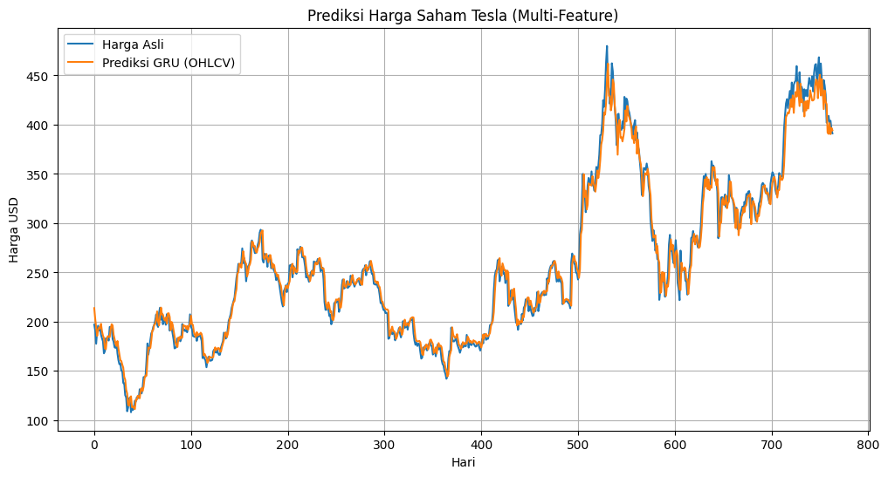

# 📈 Prediksi Harga Saham Tesla (TSLA) Menggunakan GRU

Proyek ini menerapkan **multivariate time series forecasting** menggunakan **Gated Recurrent Unit (GRU)** untuk memprediksi harga penutupan (closing price) harian saham Tesla (TSLA).  
Model memanfaatkan data historis **OHLCV** (Open, High, Low, Close, Volume) dari **Yahoo Finance** dan menggunakan **window 60 hari** untuk mempelajari pola pergerakan harga.

Hasil pengujian menunjukkan bahwa model GRU mampu memberikan prediksi yang stabil dengan tingkat error yang relatif kecil.

---

## 🗂️ Struktur Proyek

```
.
├── data/
│ └── TSLA.csv # Data historis OHLCV dari Yahoo Finance
├── models/
│ └── gru_tsla.h5 # Model GRU tersimpan
├── notebook/
│ └── tesla_gru_prediction.ipynb # Notebook lengkap (Google Colab)
└── requirements.txt
```

---

## 🧠 Arsitektur Model

Model menggunakan **dua lapis GRU** untuk memahami pola temporal jangka panjang dan jangka pendek.

### **Detail Arsitektur**
- **GRU (64 units)** – mempelajari pola pergerakan harga dalam 60 hari  
- **GRU (64 units)** – memperkuat representasi temporal  
- **Dense (1 unit)** – menghasilkan prediksi harga penutupan hari berikutnya  

### **Input**
Window 60 hari berisi 5 fitur:
- Open  
- High  
- Low  
- Close  
- Volume  

### **Output**
Prediksi harga **Close** untuk hari selanjutnya.

### **Konfigurasi Pelatihan**
- **Loss Function:** Mean Squared Error (MSE)  
- **Optimizer:** Adam  
- **Evaluasi:** MAE & RMSE  

---

## 🔁 Proses Training

1. Data OHLCV → **scaling menggunakan MinMaxScaler**  
2. **Membuat sequence** dengan window 60 hari  
3. Pembagian data: **Train 80%**, **Test 20%**  
4. Training **30 epoch**  
5. Validasi sebesar **10% dari data train**  
6. Model disimpan dalam format **.h5**  

---

## 📊 Hasil Evaluasi Model

### **Evaluasi pada Data Test**

| Metrik | Nilai |
|--------|--------|
| **MAE** | 7.8401 |
| **RMSE** | 10.6007 |

### **Interpretasi**
- Rata-rata kesalahan prediksi harga sekitar **±7.8 USD**  
- RMSE **10.6 USD** menunjukkan model stabil mengikuti pola harga  
- GRU efektif mempelajari pergerakan jangka pendek saham Tesla  

---

## 🧩 Ringkasan Model

| Layer (Type) | Output Shape | Parameter |
|--------------|--------------|-----------|
| GRU          | (None, 60, 64) | 13,632    |
| GRU          | (None, 64)     | 24,960    |
| Dense        | (None, 1)      | 65        |

**Total Parameters:** 38,657

---

## 📊 Visualization

<p align="center">
  
  <br><em>Actual vs Predicted Close (TSLA)</em>
</p>

---

## 🏁 Kesimpulan Akhir

Model **GRU multi-feature** ini mampu mempelajari pola pergerakan harga saham Tesla dengan baik.  
Dengan menggunakan lima fitur OHLCV, model memperoleh pemahaman yang lebih lengkap terhadap dinamika pasar dibandingkan model berbasis satu fitur.

Prediksi yang dihasilkan menunjukkan pola yang konsisten dengan error yang relatif kecil, sehingga model ini dapat dijadikan **baseline** untuk proyek prediksi harga saham.

Model masih dapat ditingkatkan melalui:
- Hyperparameter tuning  
- Penambahan indikator teknikal (MA, RSI, MACD)  
- Penambahan lapisan GRU/Dropout  
- Model hybrid (GRU + CNN, atau GRU + Attention)  

---

## 🚀 Cara Menjalankan Proyek

### **1. Clone repository**
```bash
git clone https://github.com/username/repo.git
```
### **2. Install dependencies**
```bash
pip install -r requirements.txt
```
### **3. Jalankan notebook**
```bash
notebook/tesla_gru_prediction.ipynb
```

---

## 👥 Tugas Project MK Kecerdasan Artifisial B - Kelompok 5

| No | Nama | NIM |
|----|------|-----|
| 1  | Rahmatun Nisa | 2308107010016 |
| 2  | Thahira Rizka | 2308107010024 |
| 3  | Davina Aura | 2308107010052 |
| 4  | Sifa Jema | 2308107010080 |

---
